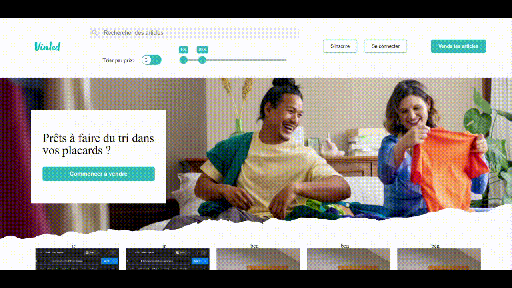

# Vinted

Fullstack Project: Vinted app is a simplified version of vinted website.
The production version of this project can be accessed at [Vinted](https://vintedmariamr.netlify.app/).

## Tech Stack

**Client:** React, CSS

**Server:** Node, Express


## Previews 




## Usage

The Vinted App allows users to buy and sell items in a simplified online marketplace. Here are some basic usage instructions:
- User Registration and Login
- Browse Listings
- Post a new offer
- Purchase items

## Installation

To run the Vinted App on your local machine, follow these steps:

1. Clone this repository to your computer:

   ```bash
   git clone https://github.com/munozmaria/vinted-frontend.git

2. Navigate to the directory:  
    ```bash
    cd vinted-frontend

3. Install dependencies:
    ```bash
        npm install
        # or
        yarn install

4. Start the application:
    ```bash
        npm start
        # or
        yarn dev

